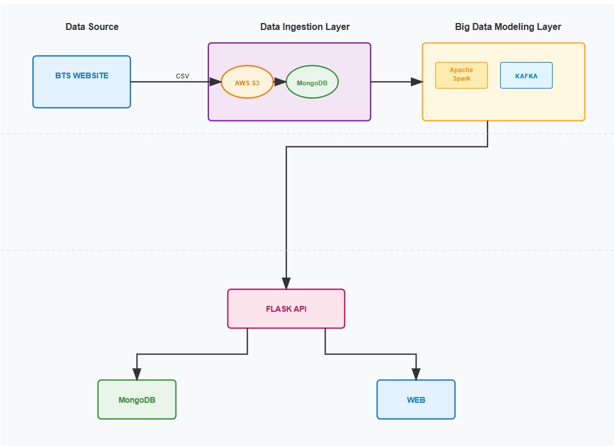

## ✈️ Flight Delay Prediction Using Big Data and Machine Learning

## Project Overview

Flight delays are a major issue in the aviation industry, affecting millions of passengers and causing significant economic losses.
With the increasing availability of real-time flight data, weather information, and air traffic control data, predicting flight delays has become essential for airlines, airports, and passengers.

This project aims to develop a Big Data-driven Flight Delay Prediction System using advanced Machine Learning (ML) algorithms and real-time data streams.
By leveraging Apache Spark, Apache Kafka, and cloud-based data storage, the system processes and analyzes vast amounts of historical and live flight data to generate accurate delay predictions.

## System Architecture

## Technologies Used
| Layer                       | Technologies               | Description                                               |
| --------------------------- | -------------------------- | --------------------------------------------------------- |
| **Data Source**             | BTS Website                | Provides raw flight delay data (CSV format).              |
| **Data Ingestion Layer**    | AWS S3, MongoDB            | Stores and manages collected flight data for processing.  |
| **Big Data Modeling Layer** | Apache Spark, Apache Kafka | Processes real-time and historical flight data streams.   |
| **API Layer**               | Flask                      | Provides a RESTful API to serve predictions and insights. |
| **Frontend**                | Web Application            | Displays prediction results and analytics to users.       |

## Project Workflow

Data Collection → Flight data is fetched from the BTS Website in CSV format.

Data Ingestion → Data is uploaded to AWS S3 and stored in MongoDB.

Data Processing → Apache Spark and Kafka are used for big data modeling and stream processing.

Prediction → ML models are trained and applied to predict flight delays.

API Layer → A Flask API delivers predictions to the web interface.

Visualization → The web dashboard shows results and insights to end users.

## Key Features

Real-time and historical flight data processing

Scalable architecture using cloud and big data tools

Integration with Apache Kafka for live data streaming

REST API for prediction access

Interactive web interface for visualization
